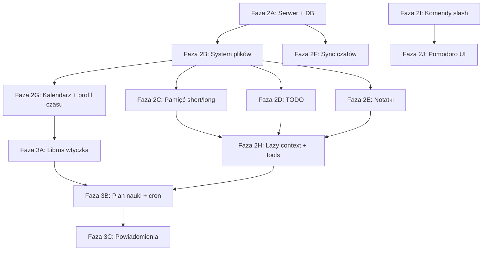

# Plan implementacji — fazy i prompty dla agentów

<!-- EPIC_AUTO_START -->

## ▶ AKTUALNY PROMPT

👉 **Skopiuj stąd:** [aktualny-prompt.md](./aktualny-prompt.md) — plik aktualizowany przez
`deno task epic:done` po każdym agencie.

### ✅ Wszystkie epiki ukończone

Ukończone: 1, 2, 3, 4, 5, 6, 7, 8, 9, 10, 11, 12, 13

## Kolejka promptów (auto)

| #  | Epik                          | Status |
| -- | ----------------------------- | ------ |
| 1  | Serwer + PostgreSQL + Drizzle | ✅     |
| 2  | Wirtualny system plików       | ✅     |
| 3  | Pamięć short/long             | ✅     |
| 4  | Globalna TODO                 | ✅     |
| 5  | Notatki Markdown              | ✅     |
| 6  | Lazy context + tools          | ✅     |
| 7  | Kalendarz + profil czasu      | ✅     |
| 8  | Komendy slash                 | ✅     |
| 9  | Pomodoro                      | ✅     |
| 10 | Wtyczka Librus                | ✅     |
| 11 | Plan nauki + cron             | ✅     |
| 12 | Powiadomienia                 | ✅     |
| 13 | Sync czatów multi-device      | ✅     |

<!-- EPIC_AUTO_END -->

---

## Checklist po epiku (dla każdego agenta)

- [ ] `deno task test` przechodzi
- [ ] Brak niezwiązanych zmian poza epikiem
- [ ] `roadmap.md` zaktualizowany
- [ ] **`deno task epic:done`** — przesuwa prompt na następny epik (obowiązkowe!)
- [ ] (opcjonalnie) wpis w `decyzje.md` jeśli była decyzja architektoniczna

> **Nie edytuj ręcznie** sekcji AKTUALNY PROMPT ani `aktualny-prompt.md` — użyj
> `deno task epic:done`.

---

> Reszta pliku: mapa zależności, pełna lista promptów, zasady równoległej pracy.

## Zależności między epikami



## Fazy (skrót)

| Faza | Epik                                                        | Priorytet | Szacunek |
| ---- | ----------------------------------------------------------- | --------- | -------- |
| 2A   | [serwer-i-sync.md](./serwer-i-sync.md) — Postgres + Drizzle | **P0**    | duży     |
| 2B   | [system-plikow.md](./system-plikow.md) — wirtualny FS       | **P0**    | duży     |
| 2C   | [pamiec.md](./pamiec.md) — short/long memory                | P1        | średni   |
| 2D   | [todo.md](./todo.md)                                        | P1        | średni   |
| 2E   | [notatki.md](./notatki.md)                                  | P1        | średni   |
| 2F   | Migracja czatów na serwer                                   | P1        | średni   |
| 2G   | [kalendarz.md](./kalendarz.md) + profil czasu               | P1        | średni   |
| 2H   | [prompty.md](./prompty.md) — lazy context, nowe tools       | P1        | średni   |
| 2I   | [komendy.md](./komendy.md)                                  | P2        | mały     |
| 2J   | Pomodoro (`/pomodoro`)                                      | P2        | mały     |
| 3A   | [librus.md](./librus.md) — wtyczka                          | P2        | duży     |
| 3B   | [plan-nauki.md](./plan-nauki.md) — cron + generowanie planu | P2        | duży     |
| 3C   | [powiadomienia.md](./powiadomienia.md) — Web Push           | P3        | średni   |

## Kolejność rekomendowana

1. **Serwer + DB** — bez tego nie ma syncu
2. **System plików** — fundament pod TODO, notatki, pamięć, kalendarz
3. **Pamięć short/long** — nadpisuje obecny `string[]`
4. **Lazy context** — agent przestaje dostawać wszystko w prompcie
5. **TODO + notatki** — szybka wartość w UI
6. **Sync czatów**
7. **Kalendarz + profil czasu**
8. **Komendy** (`/clear short memory`, `/plan`, `/pomodoro`)
9. **Librus wtyczka**
10. **Plan nauki + powiadomienia**

---

## Prompty dla agentów (archiwum / następne kroki)

Każdy prompt zakłada: przeczytaj `ai-kontekst/` (wskazane pliki), Deno monorepo, koszt 0 zł, testy
po zmianach. **Źródło prawdy promptów:** `ai-kontekst/epics.json` → generuje
[aktualny-prompt.md](./aktualny-prompt.md). Poniżej archiwum treści; po `epic:done` kopiuj z
`aktualny-prompt.md`.

---

### Prompt 1 — Serwer + PostgreSQL + Drizzle

```
Implementuj Fazę 2A ChatGPA: serwer i baza danych.

Przeczytaj:
- ai-kontekst/serwer-i-sync.md
- ai-kontekst/architektura.md
- ai-kontekst/model-danych.md
- ai-kontekst/dla-agenta.md
- ai-kontekst/plan-implementacji.md (sekcja „Checklist po epiku”)

Zadanie:
1. Dodaj PostgreSQL + Drizzle do packages/api (migracje, connection z env DATABASE_URL).
2. Tabele na start: profile, chat_threads, chat_messages, memory_entries, tasks, file_nodes (wirtualny FS).
3. Endpointy health sprawdzające DB.
4. Szkielet sync: GET /api/sync/pull, POST /api/sync/push (minimalna implementacja).
5. .env.example z DATABASE_URL.
6. Testy integracyjne z mockiem lub testcontainers jeśli możliwe.

Nie rób jeszcze: Librus, powiadomień, pełnego UI sync — tylko backend + migracje.

Po zakończeniu:
- Uruchom deno task test
- Zaktualizuj ai-kontekst/roadmap.md (odhacz PostgreSQL)
- Zaktualizuj sekcję „AKTUALNY PROMPT” w ai-kontekst/plan-implementacji.md → Prompt 2
```

---

### Prompt 2 — Wirtualny system plików

```
Implementuj Fazę 2B ChatGPA: wirtualny system plików (metafora OS).

Przeczytaj:
- ai-kontekst/system-plikow.md
- ai-kontekst/serwer-i-sync.md
- ai-kontekst/plan-implementacji.md (sekcja „Checklist po epiku”)

Zadanie:
1. API /api/fs/* — list, read, write, mkdir, delete (ścieżki sanityzowane pod ~/).
2. Seed struktury katalogów przy pierwszym uruchomieniu: memory/, todo/, notes/, calendar/, books/, plans/, profile/, school/librus/.
3. Tools dla agenta: fs.list, fs.read, fs.write (w packages/api/ai/tools.ts).
4. Prosty panel UI „Pliki” w packages/web (drzewo + podgląd tekstu).
5. Testy API fs.

Zależy od: Faza 2A (DB) — musi być gotowa.

Po zakończeniu:
- deno task test
- roadmap.md + sekcja AKTUALNY PROMPT → Prompt 3 (lub 4+5 równolegle jeśli wolisz)
```

---

### Prompt 3 — Pamięć short-term i long-term

```
Implementuj system pamięci ChatGPA (short + long term).

Przeczytaj:
- ai-kontekst/pamiec.md
- ai-kontekst/system-plikow.md
- ai-kontekst/komendy.md (sekcja /clear short memory)
- ai-kontekst/plan-implementacji.md (sekcja „Checklist po epiku”)

Zadanie:
1. MemoryEntry z kind short|long, expiresAt dla short.
2. Migracja obecnego string[] memory z localStorage → long-term.
3. Zaktualizuj tools memory.remember|list|forget|clear.
4. Plik ~/memory/long-term.memory zsynchronizowany z DB.
5. Cleanup wygasłych wpisów short (lazy lub cron).
6. Usuń wstrzykiwanie całej pamięci do system promptu — tylko przez tools.
7. UI: zakładki krótka/długa w sidebarze.

Po zakończeniu: deno task test, roadmap.md, AKTUALNY PROMPT → Prompt 6 (lazy context) lub 4 (TODO)
```

---

### Prompt 4 — Globalna TODO

```
Implementuj globalny system TODO ChatGPA.

Przeczytaj:
- ai-kontekst/todo.md
- ai-kontekst/system-plikow.md
- ai-kontekst/plan-implementacji.md (sekcja „Checklist po epiku”)

Zadanie:
1. Plik ~/todo/global.todo + tabela tasks w DB (dual write lub DB jako source of truth).
2. API CRUD /api/todos.
3. Tools todo.list, todo.add, todo.update, todo.complete, todo.delete.
4. Panel UI + komenda /todo (jeśli parser komend istnieje — jeśli nie, sam panel).
5. Testy parsera .todo i API.

Po zakończeniu: deno task test, roadmap.md, AKTUALNY PROMPT → kolejny wg kolejki
```

---

### Prompt 5 — Notatki Markdown

```
Implementuj system notatek Markdown ChatGPA.

Przeczytaj:
- ai-kontekst/notatki.md
- ai-kontekst/system-plikow.md
- ai-kontekst/plan-implementacji.md (sekcja „Checklist po epiku”)

Zadanie:
1. Notatki w ~/notes/ przez API fs lub dedykowane /api/notes.
2. UI: lista katalogów + edytor Markdown (split preview).
3. Tools notes.list, notes.read, notes.write (lub fs.* w notes/).
4. Komenda /notes otwiera panel.

Po zakończeniu: deno task test, roadmap.md, AKTUALNY PROMPT → kolejny wg kolejki
```

---

### Prompt 6 — Lazy context i rozszerzone tools

```
Przeprojektuj kontekst AI ChatGPA na model lazy (tool-based).

Przeczytaj:
- ai-kontekst/prompty.md
- ai-kontekst/pamiec.md
- ai-kontekst/dla-agenta.md
- ai-kontekst/plan-implementacji.md (sekcja „Checklist po epiku”)

Zadanie:
1. System prompt: agent NIE dostaje ocen, TODO, kalendarza, pamięci na start — tylko instrukcję użycia tools.
2. Usuń buildMemoryBlock z domyślnego promptu (memory tylko przez memory.list).
3. Dodaj tools (stuby OK jeśli brak backendu): grades.get, calendar.list, calendar.freeSlots, todo.list, fs.read.
4. Dokumentacja w prompcie: kiedy którego toola użyć.
5. Test: pytanie o oceny bez wcześniejszego sync → agent woła tool, nie zmyśla.

Po zakończeniu: deno task test, roadmap.md, AKTUALNY PROMPT → Prompt 13 (sync czatów) lub 7 (kalendarz)
```

---

### Prompt 7 — Kalendarz i profil czasu

```
Implementuj kalendarz i profil czasowy użytkownika.

Przeczytaj:
- ai-kontekst/kalendarz.md
- ai-kontekst/plan-nauki.md
- ai-kontekst/system-plikow.md
- ai-kontekst/plan-implementacji.md (sekcja „Checklist po epiku”)

Zadanie:
1. Pliki ~/calendar/YYYY-MM.cal + API.
2. Profil ~/profile/me.profile z: commute 60min, studyEnd 21:00/21:30, notification +30min po lekcjach.
3. Tool calendar.freeSlots({ date }) — liczy okna nauki wg profilu i planu lekcji (schedule.json stub jeśli brak Librus).
4. UI widok kalendarza (miesiąc/tydzień).
5. Formularz edycji profilu czasu.

Po zakończeniu: deno task test, roadmap.md, AKTUALNY PROMPT → Prompt 8 (komendy) lub 10 (Librus)
```

---

### Prompt 8 — Komendy slash

```
Implementuj system komend slash w ChatGPA.

Przeczytaj:
- ai-kontekst/komendy.md
- ai-kontekst/plan-implementacji.md (sekcja „Checklist po epiku”)

Zadanie:
1. Parser w packages/web/lib/commands.ts.
2. Komendy: /plan, /clear short memory, /pomodoro (UI), /todo, /notes, /files.
3. Autocomplete przy wpisywaniu / w composerze.
4. Seed prompty po polsku dla /plan i /plan tydzień.
5. Testy jednostkowe parsera.

Po zakończeniu: deno task test, roadmap.md, AKTUALNY PROMPT → Prompt 9 (Pomodoro)
```

---

### Prompt 9 — Pomodoro

```
Dodaj Pomodoro do ChatGPA (komenda /pomodoro).

Przeczytaj:
- ai-kontekst/komendy.md
- ai-kontekst/plan-implementacji.md (sekcja „Checklist po epiku”)

Zadanie:
1. Island PomodoroTimer: 25/5, start/pause/reset, dźwięk opcjonalny.
2. Otwieranie z /pomodoro i przycisku w UI.
3. Styl zgodny z packages/web/assets/styles.css.
4. Bez integracji z planem dnia na razie.

Po zakończeniu: deno task test, roadmap.md, AKTUALNY PROMPT → Prompt 10 (Librus)
```

---

### Prompt 10 — Wtyczka Librus

```
Zbuduj integrację Librus (wtyczka przeglądarki + endpoint sync).

Przeczytaj:
- ai-kontekst/librus.md
- ai-kontekst/kalendarz.md
- ai-kontekst/system-plikow.md
- ai-kontekst/plan-implementacji.md (sekcja „Checklist po epiku”)

Zadanie:
1. packages/extension (lub osobny folder) — content script na librus.pl.
2. Pobierz: oceny, plan lekcji, terminarz, zmiany planu.
3. POST /api/librus/sync → zapis do ~/school/librus/*.json + merge calendar.
4. Przycisk „Sync Librus” w UI + timestamp.
5. AI-assisted merge: endpoint lub job który porównuje snapshoty (nie ślepe nadpisanie).

Bezpieczeństwo: hasło Librus nie idzie do ChatGPA.

Po zakończeniu: deno task test, roadmap.md, AKTUALNY PROMPT → Prompt 11
```

---

### Prompt 11 — Plan nauki i cron

```
Implementuj automatyczny plan nauki i anty-prokrastynację.

Przeczytaj:
- ai-kontekst/plan-nauki.md
- ai-kontekst/kalendarz.md
- ai-kontekst/todo.md
- ai-kontekst/powiadomienia.md
- ai-kontekst/plan-implementacji.md (sekcja „Checklist po epiku”)

Zadanie:
1. Deno.cron: generuj plan dzienny (plik ~/plans/YYYY-MM-DD.plan).
2. Rozkładaj naukę przed sprawdzianami od T-7 (małe porcje).
3. Aktualizuj todo.scheduledFor i study_block w kalendarzu.
4. Endpoint POST /api/plan/generate?date=...
5. Jedno wywołanie AI z wąskim promptem (dane z tools/DB, nie pełny chat).

Po zakończeniu: deno task test, roadmap.md, AKTUALNY PROMPT → Prompt 12
```

---

### Prompt 12 — Powiadomienia (in-app + Web Push)

```
Implementuj powiadomienia ChatGPA.

Przeczytaj:
- ai-kontekst/powiadomienia.md
- ai-kontekst/plan-nauki.md
- ai-kontekst/plan-implementacji.md (sekcja „Checklist po epiku”)

Zadanie:
1. Cron: 30 min po ostatniej lekcji (z schedule.json) → utwórz notification + wiadomość czatu.
2. Kliknięcie powiadomienia → nowy czat z prefill wiadomością agenta + lista TODO na dziś + budżet minut.
3. In-app lista powiadomień (banner).
4. Service worker + Web Push (VAPID) — opcjonalnie w tym samym PR jeśli czas.
5. Negocjacja: odpowiedź użytkownika w czacie → przesunięcie planu (hook do istniejących tools).

Po zakończeniu: deno task test, roadmap.md, AKTUALNY PROMPT → „✅ WSZYSTKO” lub Prompt 13 jeśli sync czatów był pominięty
```

---

### Prompt 13 — Sync czatów multi-device

```
Przenieś historię czatów z localStorage na serwer z sync.

Przeczytaj:
- ai-kontekst/serwer-i-sync.md
- packages/web/lib/chat-storage.ts
- ai-kontekst/plan-implementacji.md (sekcja „Checklist po epiku”)

Zadanie:
1. CRUD /api/threads i messages.
2. Migracja jednorazowa z localStorage.
3. Klient: pull on start, push po wysłaniu wiadomości.
4. IndexedDB jako cache offline.
5. Zachowaj kompatybilność wsteczną do czasu migracji.

Po zakończeniu: deno task test, roadmap.md, AKTUALNY PROMPT → „✅ WSZYSTKO”
```

---

## Równoległa praca (subagenci)

| Równolegle                    | Warunek               |
| ----------------------------- | --------------------- |
| Prompt 1 (DB) sam             | start                 |
| Po Prompt 2: Prompt 4 + 5 + 3 | FS gotowy             |
| Prompt 8 + 9                  | niezależne od DB (UI) |
| Prompt 6                      | po podstawowych tools |

**Nie równolegle:** 10, 11, 12 przed 1, 2, 7.

## Checklist „gotowe do produkcji osobistej”

- [ ] Telefon i laptop widzą te same czaty, TODO, notatki, pamięć
- [ ] Agent pobiera kontekst przez tools, nie z promptu
- [ ] `/clear short memory`, `/plan`, `/pomodoro` działają
- [ ] Powiadomienie po szkole z planem na dziś
- [ ] Librus sync co najmniej oceny + plan lekcji
- [ ] T-7 przypomnienie przed sprawdzianem

## Jak podmienić AKTUALNY PROMPT

**Nie ręcznie.** Po każdym epiku agent uruchamia:

```bash
deno task epic:done
```

To automatycznie:

- oznacza bieżący epik jako ukończony (`ai-kontekst/epic-state.json`)
- regeneruje `ai-kontekst/aktualny-prompt.md` (skopiuj stąd do nowego agenta)
- aktualizuje sekcję na górze tego pliku i tabelę kolejki

Pomocnicze komendy: `deno task epic:status`, `deno task epic:regen`, `deno task epic:set -- 3`
(awaryjnie).
