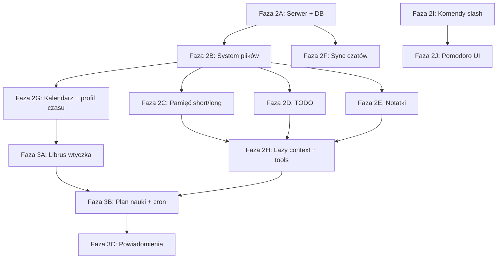

# Plan implementacji — fazy i prompty dla agentów

<!-- EPIC_AUTO_START -->

## ▶ AKTUALNY PROMPT

👉 **Skopiuj stąd:** [aktualny-prompt.md](./aktualny-prompt.md) — plik aktualizowany przez `deno task epic:done` po każdym agencie.

### ✅ Wszystkie epiki ukończone

Ukończone: 1, 2, 3, 4, 5, 6, 7, 8, 9, 10, 11, 12, 13, 14, 15, 16

## Kolejka promptów (auto)

| # | Epik | Status |
| --- | --- | --- |
| 1 | Serwer + PostgreSQL + Drizzle | ✅ |
| 2 | Wirtualny system plików | ✅ |
| 3 | Pamięć short/long | ✅ |
| 4 | Globalna TODO | ✅ |
| 5 | Notatki Markdown | ✅ |
| 6 | Lazy context + tools | ✅ |
| 7 | Kalendarz + profil czasu | ✅ |
| 8 | Komendy slash | ✅ |
| 9 | Pomodoro | ✅ |
| 10 | Wtyczka Librus | ✅ |
| 11 | Plan nauki + cron | ✅ |
| 12 | Powiadomienia | ✅ |
| 13 | Sync czatów multi-device | ✅ |
| 14 | Agent core: dłuższa pętla narzędzi + fs.grep | ✅ |
| 15 | Bezpieczne edycje plików: diff + undo | ✅ |
| 16 | Polish do codziennego użytku | ✅ |

<!-- EPIC_AUTO_END -->

---

## Checklist po epiku (dla każdego agenta)

- [ ] `deno task test` przechodzi
- [ ] Brak niezwiązanych zmian poza epikiem
- [ ] `roadmap.md` zaktualizowany
- [ ] **`deno task epic:done`** — przesuwa prompt na następny epik (obowiązkowe!)
- [ ] (opcjonalnie) wpis w `decyzje.md` jeśli była decyzja architektoniczna

> **Nie edytuj ręcznie** sekcji AKTUALNY PROMPT ani `aktualny-prompt.md` — użyj
> `deno task epic:done`.

---

> Reszta pliku: mapa zależności, pełna lista promptów, zasady równoległej pracy.

## Zależności między epikami



## Fazy (skrót)

| Faza | Epik                                                        | Priorytet | Szacunek |
| ---- | ----------------------------------------------------------- | --------- | -------- |
| 2A   | [serwer-i-sync.md](./serwer-i-sync.md) — Postgres + Drizzle | **P0**    | duży     |
| 2B   | [system-plikow.md](./system-plikow.md) — wirtualny FS       | **P0**    | duży     |
| 2C   | [pamiec.md](./pamiec.md) — short/long memory                | P1        | średni   |
| 2D   | [todo.md](./todo.md)                                        | P1        | średni   |
| 2E   | [notatki.md](./notatki.md)                                  | P1        | średni   |
| 2F   | Migracja czatów na serwer                                   | P1        | średni   |
| 2G   | [kalendarz.md](./kalendarz.md) + profil czasu               | P1        | średni   |
| 2H   | [prompty.md](./prompty.md) — lazy context, nowe tools       | P1        | średni   |
| 2I   | [komendy.md](./komendy.md)                                  | P2        | mały     |
| 2J   | Pomodoro (`/pomodoro`)                                      | P2        | mały     |
| 3A   | [librus.md](./librus.md) — wtyczka                          | P2        | duży     |
| 3B   | [plan-nauki.md](./plan-nauki.md) — cron + generowanie planu | P2        | duży     |
| 3C   | [powiadomienia.md](./powiadomienia.md) — Web Push           | P3        | średni   |
| 4A   | Agent core — dłuższa pętla narzędzi + `fs.grep`             | **P0**    | średni   |
| 4B   | Diff + undo przy `fs.write`                                 | P1        | średni   |
| 4C   | Polish do codziennego użytku                                | P1        | mały     |

> Fazy 0–3 (epiki 1–13) ukończone i ręcznie zweryfikowane 2026-09-13 — patrz
> [decyzje.md](./decyzje.md). Faza 4 (epiki 14–16) to obecny priorytet: dojrzewanie silnika agenta
> (Cursor/Claude Code/Codex), nie nowa domena. Kolejne pomysły → „Później / someday” w
> [roadmap.md](./roadmap.md).

## Kolejność rekomendowana

1. **Serwer + DB** — bez tego nie ma syncu
2. **System plików** — fundament pod TODO, notatki, pamięć, kalendarz
3. **Pamięć short/long** — nadpisuje obecny `string[]`
4. **Lazy context** — agent przestaje dostawać wszystko w prompcie
5. **TODO + notatki** — szybka wartość w UI
6. **Sync czatów**
7. **Kalendarz + profil czasu**
8. **Komendy** (`/clear short memory`, `/plan`, `/pomodoro`)
9. **Librus wtyczka**
10. **Plan nauki + powiadomienia**

---

## Prompty dla agentów (archiwum / następne kroki)

Każdy prompt zakłada: przeczytaj `ai-kontekst/` (wskazane pliki), Deno monorepo, koszt 0 zł, testy
po zmianach. **Źródło prawdy promptów:** `ai-kontekst/epics.json` → generuje
[aktualny-prompt.md](./aktualny-prompt.md). Poniżej tylko epik aktywny w pełnej treści; po
`epic:done` kopiuj z `aktualny-prompt.md`.

### Archiwum epików 1–15 (ukończone)

Pełna historyczna treść tych promptów żyje w `ai-kontekst/epics.json` (i w historii gita tego pliku
— `git log -p -- ai-kontekst/plan-implementacji.md`) — usunięta stąd, żeby ten dokument nie puchł
bez końca teraz, gdy są zrobione. Skrót: co, w jakiej fazie, który plik kontekstu przeczytać jeśli
coś w tym obszarze trzeba kiedyś zmienić.

| #  | Epik                                  | Faza | Kontekst                               |
| -- | ------------------------------------- | ---- | -------------------------------------- |
| 1  | Serwer + PostgreSQL + Drizzle         | 2A   | [serwer-i-sync.md](./serwer-i-sync.md) |
| 2  | Wirtualny system plików               | 2B   | [system-plikow.md](./system-plikow.md) |
| 3  | Pamięć short/long                     | 2C   | [pamiec.md](./pamiec.md)               |
| 4  | Globalna TODO                         | 2D   | [todo.md](./todo.md)                   |
| 5  | Notatki Markdown                      | 2E   | [notatki.md](./notatki.md)             |
| 6  | Lazy context + tools                  | 2H   | [prompty.md](./prompty.md)             |
| 7  | Kalendarz + profil czasu              | 2G   | [kalendarz.md](./kalendarz.md)         |
| 8  | Komendy slash                         | 2I   | [komendy.md](./komendy.md)             |
| 9  | Pomodoro                              | 2J   | [komendy.md](./komendy.md)             |
| 10 | Wtyczka Librus                        | 3A   | [librus.md](./librus.md)               |
| 11 | Plan nauki + cron                     | 3B   | [plan-nauki.md](./plan-nauki.md)       |
| 12 | Powiadomienia                         | 3C   | [powiadomienia.md](./powiadomienia.md) |
| 13 | Sync czatów multi-device              | 2F   | [serwer-i-sync.md](./serwer-i-sync.md) |
| 14 | Agent core: dłuższa pętla + `fs.grep` | 4A   | [system-plikow.md](./system-plikow.md) |
| 15 | Diff + undo dla `fs.write`            | 4B   | [system-plikow.md](./system-plikow.md) |

Decyzje/konsekwencje każdego epiku → [decyzje.md](./decyzje.md) (wpisy z datami).

---

### Prompt 16 — Polish do codziennego użytku

```
Zamknij Fazę 4 ChatGPA: polish i pełny ręczny przegląd przed codziennym użyciem.

Przeczytaj:
- ai-kontekst/decyzje.md (2026-09-13 „Ręczny test end-to-end”)
- packages/web/lib/threads-api.ts
- ai-kontekst/roadmap.md (sekcja Definition of Done)

Zadanie:
1. Napraw szumiące 404 w threads-api.ts — GET „czy wątek/wiadomość istnieje” przed POST zawsze failuje dla nowej rozmowy. Zamień na idempotentny POST/upsert albo inny sposób bez zbędnego requestu, który zawsze 404uje.
2. Manualny przegląd end-to-end wszystkich paneli (Pliki, TODO, Notatki, Kalendarz, Profil, status Librus, Pomodoro, Powiadomienia) w deno task dev — napraw drobne błędy znalezione po drodze, nie dodawaj nowych funkcji.
3. Przejrzyj ai-kontekst/ — skróć/zarchiwizuj nieaktualne fragmenty (np. to archiwum promptów 1–13), żeby kontekst nie puchł bez końca.
4. Upewnij się, że roadmap.md „Definition of Done” jest w pełni odhaczone, włącznie z nowym punktem o agencie poziomu Cursor/Claude Code.

Po tym epiku: ChatGPA to gotowy, przetestowany osobisty produkt — kolejne funkcje (sekcja „Później / someday” w roadmap.md) tylko na wyraźną prośbę.

Po zakończeniu: deno task test, roadmap.md, AKTUALNY PROMPT → „✅ WSZYSTKO”
```

---

## Równoległa praca (subagenci)

| Równolegle                    | Warunek               |
| ----------------------------- | --------------------- |
| Prompt 1 (DB) sam             | start                 |
| Po Prompt 2: Prompt 4 + 5 + 3 | FS gotowy             |
| Prompt 8 + 9                  | niezależne od DB (UI) |
| Prompt 6                      | po podstawowych tools |

**Nie równolegle:** 10, 11, 12 przed 1, 2, 7. Epiki 14 → 15 → 16 też sekwencyjnie — wszystkie
dotykają `chat.ts`/`tools.ts`/`threads-api.ts`, równoległa praca = konflikty.

## Checklist „gotowe do produkcji osobistej”

- [x] Telefon i laptop widzą te same czaty, TODO, notatki, pamięć
- [x] Agent pobiera kontekst przez tools, nie z promptu
- [x] `/clear short memory`, `/plan`, `/pomodoro` działają
- [x] Powiadomienie po szkole z planem na dziś
- [x] Librus sync co najmniej oceny + plan lekcji
- [x] T-7 przypomnienie przed sprawdzianem
- [ ] Agent ma pętlę narzędzi jak Cursor/Claude Code: długie rundy, `fs.grep`, diff + undo (epiki
      14–16)

## Jak podmienić AKTUALNY PROMPT

**Nie ręcznie.** Po każdym epiku agent uruchamia:

```bash
deno task epic:done
```

To automatycznie:

- oznacza bieżący epik jako ukończony (`ai-kontekst/epic-state.json`)
- regeneruje `ai-kontekst/aktualny-prompt.md` (skopiuj stąd do nowego agenta)
- aktualizuje sekcję na górze tego pliku i tabelę kolejki

Pomocnicze komendy: `deno task epic:status`, `deno task epic:regen`, `deno task epic:set -- 3`
(awaryjnie).
